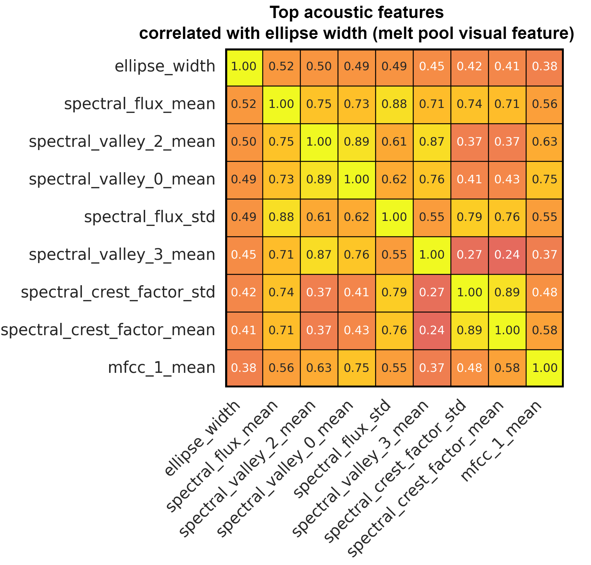

# LDED-FusionNet: Audio-Visual Fusion for Defect Detection in Laser-Directed Energy Deposition (LDED)

## Overview
This repository contains the implementation of **audio-visual feature fusion** using machine learning for defect detection and quality prediction in **Laser-Directed Energy Deposition (LDED)** additive manufacturing processes.

#### Experimental Setup and Schematic Representation
<table align="center" style="border:none;">
  <tr style="border:none;">
    <td align="center" style="border:none;">
      
      <br><b>Experimental Setup</b>
    </td>
    <td align="center" style="border:none;">
      
      <br><b>Schematic Representation</b>
    </td>
  </tr>
</table>

---

## Related Publications

1. **Multisensor Fusion-Based Digital Twin for Localized Quality Prediction in Robotic Laser-Directed Energy Deposition** *(RCIM, 2023)* [Link](https://www.sciencedirect.com/science/article/abs/pii/S0736584523000571)
   - Proposes a **Multisensor Fusion-Based Digital Twin**, leveraging **feature-level fusion** of **acoustic and visual data** for LDED quality prediction.
   - Demonstrates significant improvements in localized quality prediction.

2. **In-situ Defect Detection in Laser-Directed Energy Deposition with Machine Learning and Multi-Sensor Fusion** *(JMST, 2024)* [Link](https://link.springer.com/article/10.1007/s12206-024-2401-1)
   - Explores acoustic signals and coaxial melt pool images for defect detection.
   - Presents **intra-modality and cross-modality feature correlations** to identify critical audiovisual signatures in LDED process dynamics.
   

3. **Inference of Melt Pool Visual Characteristics in Laser Additive Manufacturing Using Acoustic Signal Features and Robotic Motion Data** *(ICCAR, 2024)* [Link](https://ieeexplore.ieee.org/abstract/document/10569391)
   - Proposes a novel technique to **infer melt pool visual characteristics** in LAM by combining **acoustic signal features** with **robotic tool-center-point (TCP) motion data**.
   - Highlights the potential of **microphone-based monitoring** as a **cost-effective alternative** for **melt pool tracking and closed-loop control** in LAM

4. **Multimodal Sensor Fusion for Real-Time Location-Dependent Defect Detection in Laser-Directed Energy Deposition** *(IDETC-CIE, 2023)* [Link](https://asmedigitalcollection.asme.org/IDETC-CIE/proceedings-abstract/IDETC-CIE2023/87295/1170490)
   - Utilizes a **hybrid CNN** to directly fuse acoustic and visual raw data.
   - Achieves high defect detection accuracy without manual feature extraction.

---

### **Repository Upgrade**
This repository is an **updated version** of the previous repository:
🔗 [LDED-Multisensor-Fusion](https://github.com/Davidlequnchen/LDED-multisensor-fusion), which originally supported the RCIM paper. Key improvements include:
- **Essentia-based Acoustic Feature Extraction**: Replaces `librosa` with `Essentia`, which is more systematic, efficient, and suitable for **production ML algorithms**.
- **Expanded Cross-Modality Analysis**: Provides an in-depth understanding of **audio-visual feature correlation**, along with additional **ablation studies** to analyze feature effectiveness.
- **Excludes Virtual Quality Map Construction**: Unlike the previous repository, this code **does not include spatial registration of robot motion into multisensor features** or ML predictions. The **visualization and virtual quality map construction** remain in the **older repository**: 🔗 [LDED-Multisensor-Fusion](https://github.com/Davidlequnchen/LDED-multisensor-fusion).

## Related Code

### [ Multisensor fusion-based digital twin framework, RCIM (2023)](https://www.sciencedirect.com/science/article/abs/pii/S0736584523000571)
<div style="text-align: center;">
  
  <br><b>Figure 1. Multisensor fusion-based digital twin framework.</b>
</div>


<div style="text-align: center;">
  
  <br><b>Figure 2. Visualization of Audio-Visual Singal During LDED process.</b>
</div>


*Related code:*
- `1_vision_audio_segmentation.ipynb`
- `1b_audio_signal_preprocessing.ipynb`
- `1c_audiovisual_signal_visualization.ipynb`

### [AudioVisual Cross Modality Analysis, JMST (2024)](https://link.springer.com/article/10.1007/s12206-024-2401-1)
<table align="center">
  <tr>
    <td align="center"><br><b>Cross-Modality Correlation Heatmap</b></td>
    <td align="center"><br><b>Audiovisual Feature Fusion Results</b></td>
  </tr>
</table>

*Related code:*
- `2_feature_extraction.ipynb`
- `2b_spatiotemporal_feature_fusion.ipynb`
- `2c_audiovisual_feature_analysis.ipynb`

### [Inference of Melt Pool Visual Characteristics Using Acoustic Signal, ICCAR (2024)](https://ieeexplore.ieee.org/abstract/document/10569391) 

<div style="text-align: center;">
  
  <br><b>Figure 3. Inference of Melt Pool Visual Characteristics Using Acoustic Signal.</b>
</div>


*Related code:*
- `3_meltpool_feature_prediction.ipynb`

### [IDETC-CIE (2023)](https://asmedigitalcollection.asme.org/IDETC-CIE/proceedings-abstract/IDETC-CIE2023/87295/1170490)

<div style="text-align: center;">
  
  <br><b>Figure 4. Hybrid CNN model fusing acoustic and visual sensor data.</b>
</div>

*Related code:*
- `5c_audiovisual_CNN.ipynb`


---

## Installation

- Create and activate conda environment:
  ```bash
  conda create --name torch python=3.8.10
  conda activate torch
  ```

- Check CUDA and install PyTorch:
  ```bash
  nvcc --version
  nvidia-smi
  conda install pytorch torchvision torchaudio cudatoolkit=11.0 -c pytorch
  ```

- Verify GPU usage:
  ```python
  import torch
  print(torch.cuda.is_available())
  ```

- Install additional dependencies:
  ```bash
  pip install -r requirements.txt
  ```

---

## Citation
Here's a comprehensive and clear revision for your **Citation** section:

---

## Citation

If you find this repository or the associated dataset useful in your research, please cite the relevant papers as follows:

**1. Multisensor Fusion-Based Digital Twin for Localized Quality Prediction in Robotic Laser-Directed Energy Deposition** *(RCIM, 2023)*:
```
@article{chen2023digitaltwin,
  title={Multisensor Fusion-Based Digital Twin for Localized Quality Prediction in Robotic Laser-Directed Energy Deposition},
  author={Chen, Lequn and others},
  journal={Robotics and Computer-Integrated Manufacturing},
  year={2023},
  publisher={Elsevier},
  url={https://www.sciencedirect.com/science/article/abs/pii/S0736584523000571}
}
```

**2. In-situ Defect Detection in Laser-Directed Energy Deposition with Machine Learning and Multi-Sensor Fusion** *(JMST, 2024)*:
```
@article{chen2024multisensorfusion,
  title={In-situ Defect Detection in Laser-Directed Energy Deposition with Machine Learning and Multi-Sensor Fusion},
  author={Chen, Lequn and others},
  journal={Journal of Mechanical Science and Technology},
  year={2024},
  publisher={Springer},
  url={https://link.springer.com/article/10.1007/s12206-024-2401-1}
}
```

**3. Inference of Melt Pool Visual Characteristics in Laser Additive Manufacturing Using Acoustic Signal Features and Robotic Motion Data** *(ICCAR, 2024)*:
```
@inproceedings{chen2024inference,
  title={Inference of Melt Pool Visual Characteristics in Laser Additive Manufacturing Using Acoustic Signal Features and Robotic Motion Data},
  author={Chen, Lequn and others},
  booktitle={2024 International Conference on Control, Automation and Robotics (ICCAR)},
  year={2024},
  publisher={IEEE},
  url={https://ieeexplore.ieee.org/abstract/document/10569391}
}
```

**4. Multimodal Sensor Fusion for Real-Time Location-Dependent Defect Detection in Laser-Directed Energy Deposition** *(IDETC-CIE, 2023)*:
```
@inproceedings{chen2023multimodal,
  title={Multimodal Sensor Fusion for Real-Time Location-Dependent Defect Detection in Laser-Directed Energy Deposition},
  author={Chen, Lequn and Yao, Xiling and Feng, Wenhe and Chew, Youxiang and Moon, Seung Ki},
  booktitle={Proceedings of the ASME 2023 International Design Engineering Technical Conferences and Computers and Information in Engineering Conference},
  year={2023},
  publisher={ASME},
  url={https://asmedigitalcollection.asme.org/IDETC-CIE/proceedings-abstract/IDETC-CIE2023/87295/1170490}
}
```

--- 

Feel free to let me know if you have any additional requests!

## License
Released under the MIT License.


